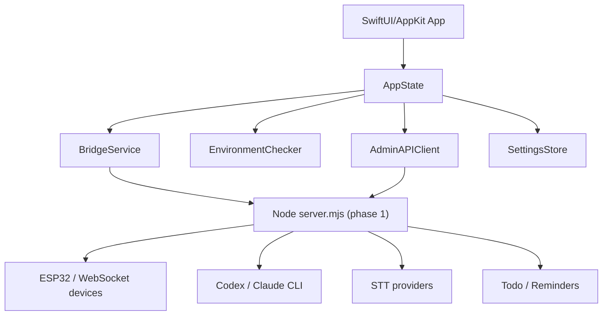

# macOS 原生客户端重构计划

## 目标

把当前 Electron 客户端重构为 SwiftUI + AppKit 原生 macOS 客户端。最终交付形态是独立 `.app` / `.dmg`，用户拖入“应用程序”后即可运行；客户端负责窗口、菜单栏、系统权限、环境检测、一键安装、服务生命周期、设备/待办/提醒同步管理和日志查看。

## 当前客户端功能清单

### Electron 主进程

- 单实例运行、主窗口创建、关闭时隐藏到菜单栏。
- 菜单栏状态菜单：打开窗口、启动/重启/停止服务、切换 Inject/Codex/Claude 模式、开机启动、隐藏启动、关闭到菜单栏、打开配置目录、退出。
- 启动 `client/server/src/server.mjs` 本地服务，等待 WebSocket `server_ready`。
- 捕获服务 stdout/stderr 日志并推送 UI。
- 读取/保存 `~/Library/Application Support/vibecoding-plus/config.env`。
- 读取/保存 `desktop-settings.json`。
- 环境检测和一键安装：Homebrew、remindctl、Claude CLI、Codex CLI、whisper.cpp、STT 配置、macOS 权限入口。
- 打开目录选择器、打开配置目录、打开系统权限设置、打开终端登录 CLI。
- 本地 HTTP Admin API 代理：设备、服务状态、待办、提醒同步、显示配置、发现设备。
- 系统通知：设备断开通知。

### Electron 渲染器

- 服务概览：状态、模式、端口、STT、发现服务、连接数、运行时长。
- 设备页：设备 ID、板型、IP、连接时间、重新发现。
- 待办页：创建、完成/恢复、删除、归档展示、删除同步提醒事项结果提示。
- 提醒同步页：同步状态、提醒列表、立即同步。
- 显示配置页：待办刷新、编码刷新、浅色/深色，提示是否需要重启。
- 环境页：缺失项检测、逐项安装、全部安装、日志、权限/登录入口。
- 设置页：发送目标、STT 提供商及各 provider 参数、LAN secret、Codex/Claude 工作目录、危险选项、桌面选项。
- 日志页：CLI 日志、服务日志、过滤。
- WebSocket 实时状态：CLI 会话、转写、用户/助手文本、设备事件。

### Node 服务端

- WebSocket 服务、设备认证、语音流处理、转写、输入注入、Codex/Claude 会话、todo 语音模式。
- HTTP Admin API：`/api/admin/devices`、`/service-status`、`/todos`、`/todo-sync`、`/todo-sync/lists`、`/todo-sync/run`、`/display-config`、`/env`、`/restart`、`/discover`。
- Apple Reminders 同步通过 `remindctl`。
- 配置解析和校验、路径解析、STT provider 支持。

## 重构策略

### 阶段 1：替换客户端壳层

新增 `client/macos-native/`。用 SwiftUI + AppKit 实现原生窗口、菜单栏、服务生命周期、环境检测、安装、权限入口、设备/待办/日志/设置界面。此阶段仍调用现有 Node 服务作为本地业务后端，但 Electron 退出主路径。

原因：当前 Node 服务包含大量业务逻辑和硬件/WebSocket 协议，直接全量重写会同时影响 ESP32 设备、语音、Codex/Claude、提醒同步和 todo。先替换客户端壳层可以快速获得原生体验，同时保留可运行功能。

当前实现要求：原生 `.app` 必须自带 Node runtime、`client/server` 服务代码和 `ws` 依赖。用户安装 App 后不需要手动安装 Node，也不需要保留开发仓库目录。

### 阶段 2：把系统能力迁到 Swift/AppKit

优先迁移这些模块：

- 环境检测和安装脚本执行。
- macOS 权限检测和跳转。
- 登录项、菜单栏、通知、文件选择器。
- AppleScript/Accessibility 输入注入。
- Apple Reminders 原生 EventKit 读写，替代 `remindctl`。

### 阶段 3：重构业务后端

按模块替换 Node 服务：

- 配置模型和存储。
- Todo 存储、显示配置、提醒同步。
- Codex/Claude 进程管理。
- STT provider 调用。
- WebSocket 设备协议。

阶段 3 完成后删除 `client/server` 对桌面 App 的运行依赖，仅保留 CLI 或兼容工具需要的部分。

## 原生客户端架构



## 原生样式要求

- 使用 macOS 26 SDK 的 Liquid Glass 体系：`buttonStyle(.glass/.glassProminent)`、AppKit `NSGlassEffectView` 可用时优先使用。
- 主界面使用 `NavigationSplitView`，保留 macOS 原生侧栏、工具栏和紧凑表单。
- 内容区使用系统材质和玻璃容器，不使用营销式卡片和大段说明。
- 所有状态提示必须短句、可操作：保存成功、是否立即生效、是否需要重启、安装失败原因。
- 支持浅色/深色和系统外观。

## 第一版验收范围

- 能编译出 SwiftUI macOS App。
- 能从原生客户端启动/停止/重启 App 包内本地服务。
- App 包内包含官方 Node.js macOS runtime、`client/server` 和 `node_modules/ws`。
- 能显示服务状态、服务日志、设备列表、待办列表。
- 能执行环境检测和逐项安装。
- 能打开配置目录、权限设置、CLI 登录终端。
- 能保存核心配置项：发送目标、STT provider、工作目录、LAN secret、桌面选项。

## 打包产物

- `npm run native:dist:mac`：生成自包含原生 `.app` 和 zip。
- `dist-native/VibeCoding Plus.app`：可直接拖入 `/Applications` 使用。
- `dist-native/VibeCoding Plus-native-Release-<arch>.zip`：分发压缩包。

App 内 runtime 结构：

```text
VibeCoding Plus.app/
└── Contents/Resources/runtime/
    ├── node/bin/node
    ├── client/server/
    ├── node_modules/ws/
    └── package.json
```

## 后续删除 Electron 的条件

- 原生客户端覆盖 Electron 当前所有 P0/P1 功能。
- `npm test` 和原生客户端构建通过。
- 打包后的 `.app` 能从 `/Applications` 启动并找到内置后端或纯 Swift 后端。
- 完成配置兼容验证：旧 `config.env` 和 `desktop-settings.json` 无需迁移即可读取。
